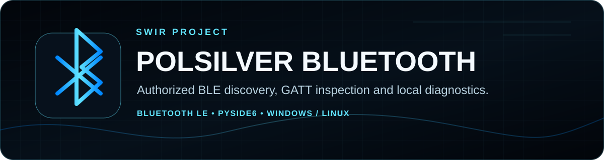

<!-- SWIR-README-STANDARD:v2 -->

<div align="center">



# PolSilver Bluetooth

**Cross-platform Bluetooth Low Energy diagnostics for devices you own, administer, or have explicit permission to inspect.**


[](https://github.com/Swir)
[](https://github.com/Swir/PolSilver_Bluetooth/releases/tag/v2.1.0)
[](https://github.com/Swir/PolSilver_Bluetooth/stargazers)

[**Highlights**](#-highlights) · [**Quick Start**](#-quick-start) · [**Workflow**](#-workflow) · [**Safety**](#-responsible-use-and-safety-boundary) · [**Releases**](#-releases)

</div>


## 📍 Project Status

| Item | Status |
|---|---|
| Current release | [`v2.1.0`](https://github.com/Swir/PolSilver_Bluetooth/releases/tag/v2.1.0) |
| Supported source runtime | Python 3.10–3.14 |
| Desktop platforms | Windows and Linux paths are implemented; capabilities differ by OS |
| Product progress | **N/A** — no canonical product roadmap is maintained |
| Safety boundary | Authorized, non-destructive diagnostics only; see [`SECURITY.md`](SECURITY.md) |

<p align="center">
  
</p>

Product progress is intentionally **N/A**. The repository has releases, tests and a regression-restoration history, but no authoritative product roadmap with a reproducible completion denominator.

## 🚀 Overview

**PolSilver Bluetooth 2.1** is a PySide6 desktop application for bounded Bluetooth Low Energy discovery, advertisement inspection, authorized GATT inspection, pairing requests and local adapter diagnostics. It uses Bleak for BLE operations and operating-system facilities for platform-specific diagnostics.

The application is designed for devices you own, administer or have explicit permission to inspect. The modern code deliberately does not restore intrusive features from older versions such as automated MITM workflows, forced sniffing, destructive resets or unauthorized connection testing.

## ✨ Highlights

| Feature | What it does |
|---|---|
| 📡 Bounded BLE discovery | Scan nearby BLE advertisements for a user-selected 1–20 second interval. |
| 📶 Signal information | Show RSSI quality plus available advertisement metadata. |
| 🔎 Authorized GATT inspection | Inspect a selected device and read the standard battery characteristic when exposed. |
| 🔗 OS-backed pairing | Request pairing for one explicitly selected device after confirmation; the OS still controls the procedure. |
| 🖥️ Local adapter diagnostics | Read platform-specific Bluetooth information without modifying adapter state. |
| 🐧 Linux inventory/history | Read paired/connected devices via `bluetoothctl` and recent BlueZ service history. |
| 🪟 Windows diagnostics | Surface Bluetooth PnP, service and recent BTHUSB event information where Windows exposes it. |
| 🦈 Wireshark launcher | Open an already installed Wireshark application without selecting interfaces or starting capture automatically. |
| 💾 Export | Save scan results as JSON/CSV and diagnostics logs as text. |
| 🌐 PL / EN / NO UI | Detect the system language with manual switching and English fallback. |

## 🧭 Regression Audit Result

PolSilver Bluetooth 2.1 was compared against both legacy implementations (`run.py` and `GUI Ver,py`). The modular application remains the primary implementation, while useful non-destructive workflows that disappeared during modernization were restored or replaced with safer equivalents.

### Restored / improved

- bounded nearby BLE discovery;
- RSSI and advertisement metadata;
- authorized GATT inspection and standard battery reading;
- explicit OS-backed pairing for one selected device;
- paired/connected device inventory on Linux;
- recent Bluetooth connection/history diagnostics where the OS exposes them;
- optional Wireshark launcher;
- text diagnostic-log export plus JSON/CSV scan export;
- double-click inspection flow;
- custom PolSilver icon in the GUI, README and packaged Windows EXE;
- PL / EN / NO interface.

### Intentionally not restored

The old versions exposed operations that do not belong in a safe diagnostics utility. Version 2.1 does **not** restore automated MITM/Bettercap attacks, unauthorized-connection testing, forced sniffing, destructive Bluetooth reset, firmware/package modification, forced visibility changes or comparable intrusive operations. These omissions are intentional, not regressions.

## ⚙️ Quick Start

### Windows release

The latest verified public package is [**v2.1.0**](https://github.com/Swir/PolSilver_Bluetooth/releases/tag/v2.1.0). Release assets include a Windows EXE, EXE checksum, portable ZIP and ZIP checksum.

### From source

```bash
git clone https://github.com/Swir/PolSilver_Bluetooth.git
cd PolSilver_Bluetooth
python -m venv .venv
# Windows: .venv\Scripts\activate
# Linux/macOS shell syntax: source .venv/bin/activate
python -m pip install --upgrade pip
pip install -e .
python -m polsilver
```

Linux normally requires BlueZ and permission to access the local Bluetooth adapter. Windows uses Bleak's WinRT backend. The repository does not claim equivalent feature coverage on every OS.

## 📋 Requirements / Compatibility

| Component | Current scope |
|---|---|
| Python | `>=3.10`; CI covers 3.10, 3.11, 3.12, 3.13 and 3.14 |
| GUI | PySide6 / Qt 6 |
| BLE | Bleak 1.x |
| Windows | BLE via WinRT plus Windows-specific local diagnostics; Windows EXE release available |
| Linux | BLE via the available Bleak backend, plus BlueZ/`bluetoothctl`-based local diagnostics |
| Wireshark | Optional; only launched when already installed |

Bluetooth hardware, drivers, permissions and OS services still determine what can actually be discovered or inspected on a given machine.

## 🎮 Workflow

1. Start **Scan nearby BLE**.
2. Select a device from the result table.
3. Use **Inspect selected device** only for a device you own, administer or are authorized to test.
4. Use **Pair selected device** only when you intend to pair that device; PolSilver asks for confirmation and the operating system controls the final pairing procedure.
5. Use **Local adapter report** for read-only operating-system diagnostics.
6. Export scan data or save the diagnostics log when needed.
7. **Open Wireshark** only launches the local application. Select and capture only interfaces/traffic you are authorized to inspect.

## 🧠 Technology / Project Layout

```text
src/polsilver/
  app.py          # Qt GUI, pairing confirmation, export/log actions
  ble.py          # BLE discovery, authorized GATT inspection and pairing
  system.py       # read-only local adapter/history diagnostics + Wireshark launcher
  models.py       # diagnostic models
  config.py       # per-user settings
  export.py       # JSON/CSV exports
  i18n.py         # PL/EN/NO translations
assets/
  polsilver.svg   # source application artwork
  readme/         # SWIR README PRO hero and progress graphics
tests/
tools/build_icon.py
tools/generate_progress_svg.py
.github/workflows/
```

Settings are stored in the user profile rather than in the repository.

## 🧪 Development and Tests

```bash
pip install -e ".[dev]"
pytest
python -m polsilver --smoke-test
python tools/generate_progress_svg.py --check
```

The CI matrix tests Python **3.10–3.14**. Windows CI also initializes the real Qt main window in smoke-test mode. Release automation separately builds the one-file EXE and performs packaged-GUI verification before publication.

## 🗺️ Progress

<p align="center">
  
</p>

There is no canonical roadmap in the current repository, so product completion remains **N/A**. The progress SVG generator deliberately refuses to invent a percentage from release numbers, test counts or modernization history.

## 📦 Releases

The latest verified public release is [**v2.1.0**](https://github.com/Swir/PolSilver_Bluetooth/releases/tag/v2.1.0), published on September 17, 2026. It contains:

- `PolSilverBluetooth.exe`;
- `PolSilverBluetooth.exe.sha256`;
- `PolSilver-Bluetooth-v2.1.0-Windows-x64.zip`;
- `PolSilver-Bluetooth-v2.1.0-Windows-x64.zip.sha256`.

[**Browse all GitHub Releases →**](https://github.com/Swir/PolSilver_Bluetooth/releases)

## 🛡️ Responsible Use and Safety Boundary

Bluetooth identifiers and advertisements can be privacy-sensitive. Do not collect, publish or retain third-party device data without a legitimate reason and appropriate permission. Pairing, connection inspection and traffic capture must be limited to devices/infrastructure you own, administer or have explicit authorization to test.

The project intentionally excludes automated interception, credential capture, forced access and destructive Bluetooth operations. See [`SECURITY.md`](SECURITY.md) for the maintained safety boundary.

## 🔎 Search Keywords

`bluetooth low energy diagnostics` • `python bluetooth gui` • `bleak bluetooth scanner` • `PySide6 bluetooth app` • `authorized GATT inspection` • `BLE device scanner` • `windows bluetooth diagnostics` • `linux bluez diagnostics` • `bluetooth RSSI monitor` • `bluetooth advertisement inspector` • `BLE battery characteristic` • `bluetooth scan export`


<div align="center">


### `DISCOVER • INSPECT • DIAGNOSE • EXPORT`

**PolSilver Bluetooth — by Swir**

[**← SWIR profile**](https://github.com/Swir) · [**All projects →**](https://github.com/Swir?tab=repositories) · [**Report an issue**](https://github.com/Swir/PolSilver_Bluetooth/issues)

</div>
